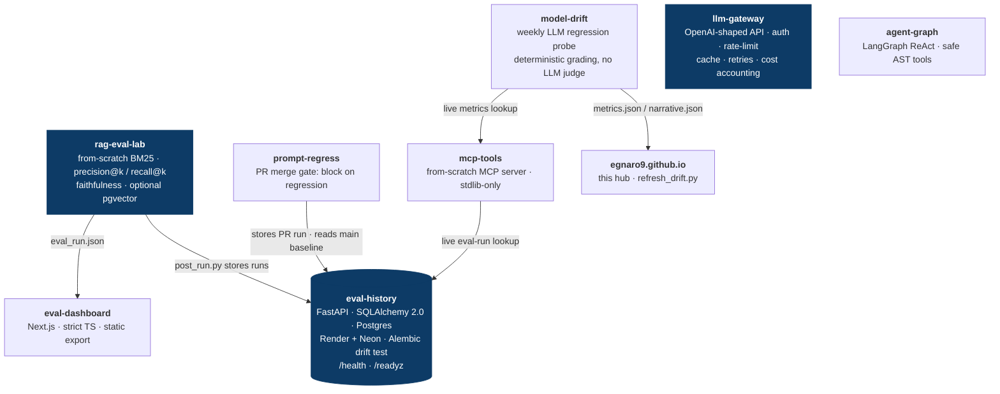

# egnaro9.github.io

Portfolio site for **Erik Hill** — agentic systems engineer.

**Live:** https://egnaro9.github.io · Hand-written HTML/CSS, no framework, no build.

This repo is the site's source, but it's also the **hub of a working system**: a
set of small, single-purpose repos that probe LLMs for regressions, store the
results in a real service, gate merges on them, and prove their own correctness.
The site links out to each; this README maps how they actually fit together, so
you can see the shape without leaving GitHub.

## The system these repos form

The center of gravity is **`eval-history`** — a deployed FastAPI + Postgres
service that other repos write to and read from. Every arrow below is a real
data path in the code, not an aspiration.



`llm-gateway` and `agent-graph` stand alone (a service and an agent you run
directly); everything else feeds into or reads from `eval-history`.

## Backend & infra — where the depth is

Most of these read as libraries or CLIs. The backend story lives in one place
and is easy to miss, so, plainly:

- **`eval-history` is a real, running service.** FastAPI + SQLAlchemy 2.0 over
  **Neon Postgres**, deployed on **Render** ([live OpenAPI docs](https://eval-history.onrender.com/docs)).
  It has a **liveness/readiness split** (`/health` vs `/readyz`, 503 on DB-down
  without restart-looping), **Alembic migrations** with a model↔migration
  **drift test**, and **CI that runs the suite against SQLite *and* real
  Postgres 16 & 18**. IaC via `render.yaml`; secrets generated, never committed.
- **`rag-eval-lab` is a second live service** — a FastAPI wrapper over the RAG
  pipeline on **Render** ([live](https://rag-eval-lab.onrender.com/healthz)):
  `POST /query`, `POST /eval`, `GET /healthz`, structured logging, and a pgvector
  path exercised in CI against a real pgvector Postgres.
- **`llm-gateway`** is production-shaped API discipline: versioned `/v1` routes,
  correct status semantics (401/429 with integer `Retry-After`/502/422), DI
  bearer auth, token-bucket rate limiting, retry, per-model cost accounting, and
  SSE streaming — behind one OpenAI-compatible contract.
- The **CI/infra habits** repeat across repos: green CI as the default, zero
  committed secrets, deterministic tests, and — in `model-drift` — a weekly cron
  that files a regression as a GitHub issue.

Framed as *managed Postgres · health checks · IaC · migrations · CI-against-real-DB*,
this is a cloud/infra story that maps concept-for-concept onto AWS primitives
(RDS · ALB health checks · CloudFormation · CodePipeline). It's built on Render +
Neon, and it's honest to say so.

## The repos

| Repo | What it is | What it proves |
|---|---|---|
| **[eval-history](https://github.com/egnaro9/eval-history)** | FastAPI + Postgres regression store for LLM eval runs | API design · data modeling · Alembic migrations · dual-DB CI · health/readiness |
| **[llm-gateway](https://github.com/egnaro9/llm-gateway)** | Multi-provider LLM gateway, OpenAI-shaped | API contract design · auth · rate limiting · caching · retries · cost accounting |
| **[model-drift](https://github.com/egnaro9/model-drift)** | Weekly public LLM regression tracker | deterministic grading · frozen fingerprinted suite · cron CI · regression-as-issue |
| **[rag-eval-lab](https://github.com/egnaro9/rag-eval-lab)** | Dependency-free RAG pipeline + eval harness | IR/ML metrics (BM25 · precision@k · recall@k · faithfulness) · pgvector · honest negatives |
| **[mcp-tools](https://github.com/egnaro9/mcp-tools)** | From-scratch MCP server (stdio, stdlib-only) | protocol implementation · safe tool sandboxing (AST allow-list) · live service lookups |
| **[agent-graph](https://github.com/egnaro9/agent-graph)** | LangGraph ReAct agent with guarded tools | multi-step tool use · deterministic/testable tools · max-step safety guard |
| **[prompt-regress](https://github.com/egnaro9/prompt-regress)** | PR merge gate that blocks on eval regression | CI gating · dependency inversion · built on `eval-history` |
| **[eval-dashboard](https://github.com/egnaro9/eval-dashboard)** | Next.js + strict-TS dashboard for eval runs | TypeScript · runtime schema validation · static export |
| **[match3-engine](https://github.com/egnaro9/match3-engine)** | Standalone match-3 rules engine (Java) | property-based testing (16 jqwik invariants, 59 tests) · JVM→JS porting |
| **[evals-differential-oracle](https://github.com/egnaro9/evals-differential-oracle)** | The same logic written twice + invariant tests | differential testing / cross-implementation correctness |
| **[agentic-dev-harness](https://github.com/egnaro9/agentic-dev-harness)** | Architecture case study | system-design write-up of the harness that builds these |

## About this repo specifically

Hand-written HTML/CSS — no framework, no build step. It showcases an autonomous
development harness (a self-reviewing agent loop: Strategy → Execution → Critic →
Evaluation → Ops), a differential oracle that proves correctness across two
independent implementations, and a human-in-the-loop autonomy ladder.

One paragraph on the homepage — the drift board summary — is **generated**, not
hand-written: `tools/refresh_drift.py` splices in the text `model-drift`
produces, where every sentence is a predicate over the board's own numbers. It
refuses more readily than it writes (an empty, too-short, wrong-tag, or
unreachable paragraph exits non-zero and changes nothing). That refuse-or-write
policy is pinned down by [`tools/test_refresh_drift.py`](tools/test_refresh_drift.py),
run in [CI](.github/workflows/ci.yml) alongside a link-checker that keeps the
outbound links from rotting.

```bash
python -m pytest tools/ -q        # the refresh-drift refuse-or-write policy
```

---

Built by [Erik Hill](https://egnaro9.github.io) · MIT licensed.
